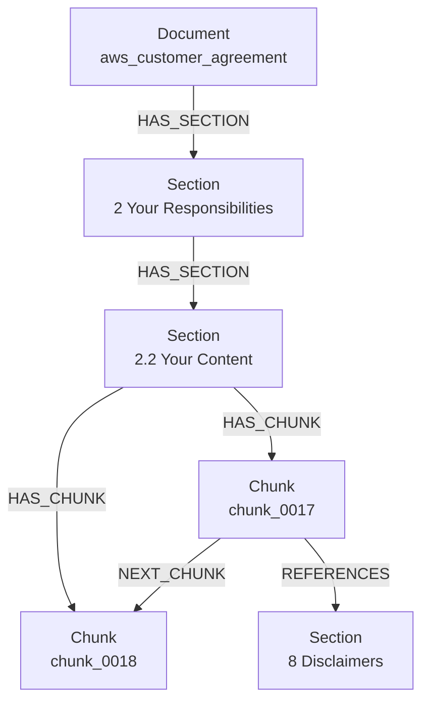

# Step 1: Document Graph Generation

## Goal

Build a durable graph JSON from `resources/AWS Customer Agreement.pdf`.
This step owns document structure only: no Neo4j writes and no embeddings.

The output is `document_graph.json`:

```text
Document
  -> Section
      -> Chunk
```

## Approach

`document_processor.py` uses `pymupdf4llm` layout boxes to keep the PDF order and extract readable text blocks. It then:

1. Creates one `Document`.
2. Creates stable `Section` nodes from numbered headings such as `2` and `2.2`.
3. Places opening unnumbered content under `section_front_matter`.
4. Creates ordered `Chunk` records from each extracted text block.
5. Links chunks with `previous_chunk_id` and `next_chunk_id`.
6. Resolves text references like `Section 2.2` to stable section IDs such as `section_2_2`.
7. Validates graph invariants before writing or when run with `--validate-only`.

## Graph Shape



## Output Schema

Document fields:

```json
{
  "document_id": "aws_customer_agreement",
  "title": "AWS Customer Agreement",
  "source_path": "resources/AWS Customer Agreement.pdf",
  "source_type": "pdf",
  "source_hash": "sha256:...",
  "processor_version": "document_graph.v1"
}
```

Section fields:

```json
{
  "section_id": "section_2_2",
  "section_number": "2.2",
  "title": "Your Content",
  "level": 2,
  "parent_section_id": "section_2",
  "child_section_ids": [],
  "chunk_ids": ["chunk_0017"],
  "order": 4
}
```

Chunk fields:

```json
{
  "chunk_id": "chunk_0017",
  "section_id": "section_2_2",
  "section_number": "2.2",
  "text": "2.2 Your Content...",
  "chunk_type": "section_heading",
  "order": 17,
  "page_start": 2,
  "page_end": 2,
  "previous_chunk_id": "chunk_0016",
  "next_chunk_id": "chunk_0018",
  "referenced_section_ids": ["section_8"],
  "referenced_by_chunk_ids": []
}
```

## Reference Rules

- `Section 2.2` references point to `section_2_2`.
- References are attached to the chunk containing the text mention.
- Reverse metadata is materialized as `referenced_by_chunk_ids` for JSON consumers.
- Neo4j only needs the forward `Chunk -[:REFERENCES]-> Section` edge; reverse lookup is traversal.

## Run

Build graph JSON:

```bash
../../venv/bin/python document_processor.py
```

Validate existing graph JSON:

```bash
../../venv/bin/python document_processor.py --validate-only
```
